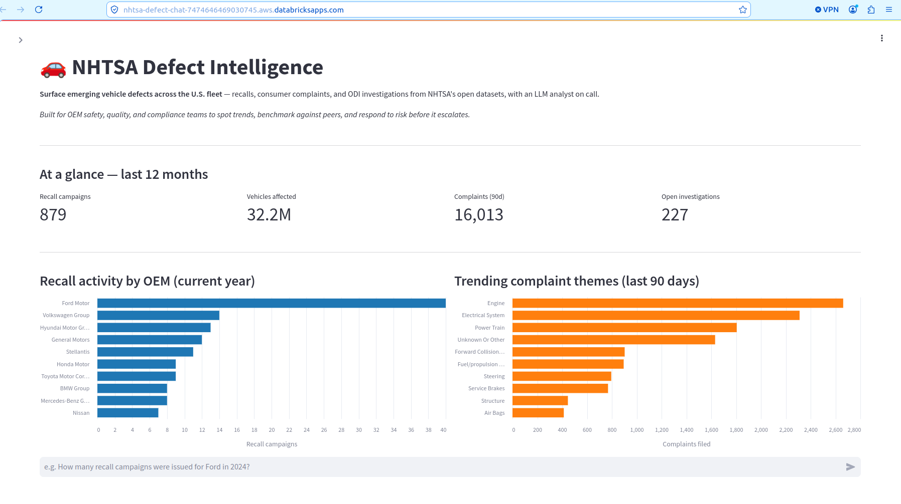
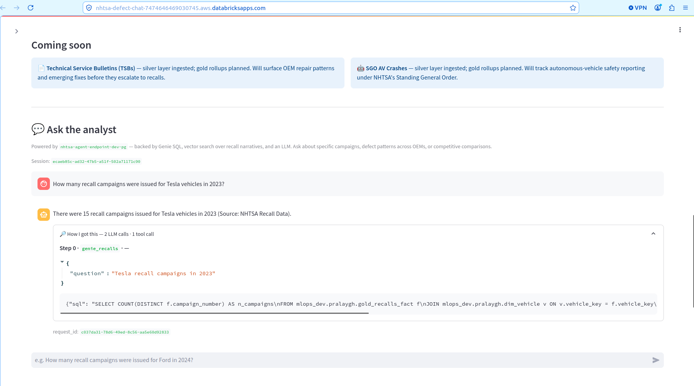
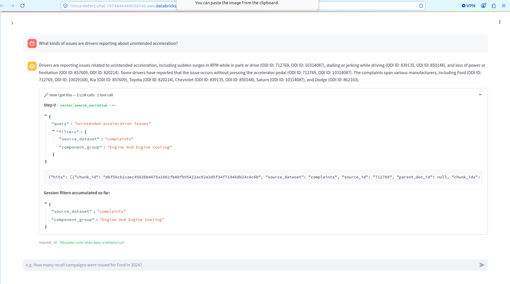
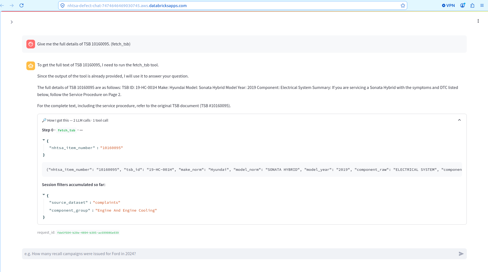
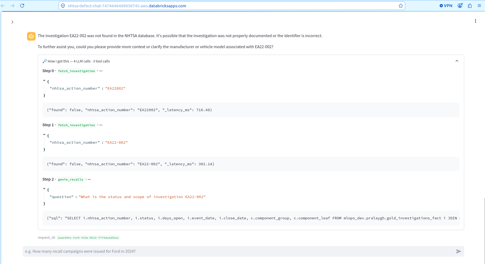
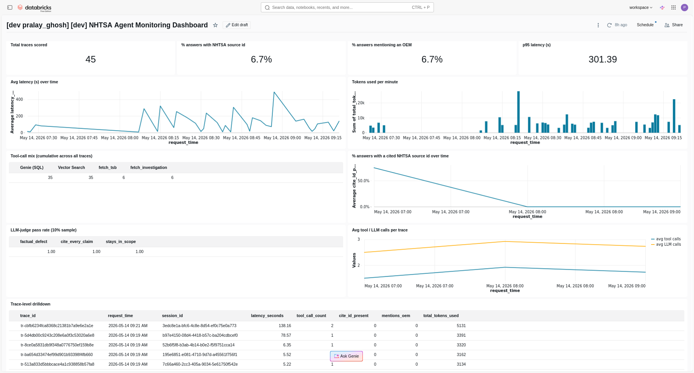
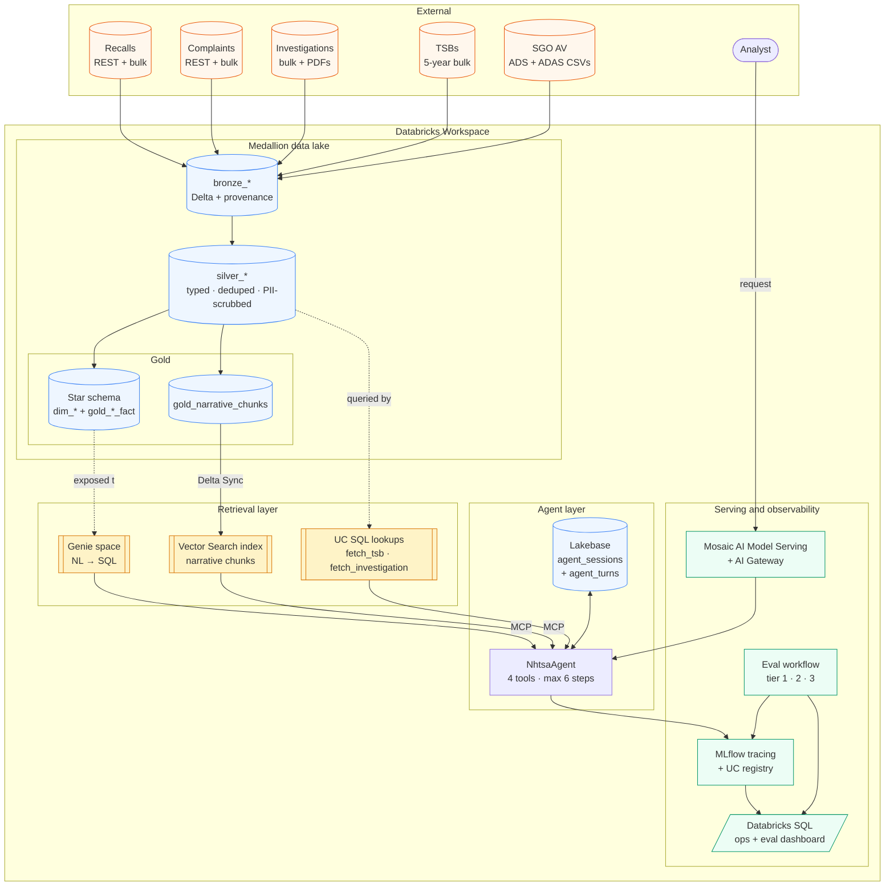

# 🚗 NHTSA Defect Intelligence

> **A natural-language safety analyst for the U.S. vehicle fleet — built end-to-end on Databricks.**
> Surface emerging defects across five NHTSA data streams (recalls, complaints, ODI investigations, TSBs, SGO AV crashes) through one chat interface, with every claim cited back to a campaign number, ODI ID, or TSB.

[](https://www.python.org/)
[](https://www.databricks.com/product/databricks-apps)
[](https://mlflow.org/)
[](https://github.com/astral-sh/uv)
[](https://github.com/ghoshp83/nhtsa_defect_intel/actions/workflows/ci.yml)
[](LICENSE)



---

## Why this matters

A safety analyst at an OEM, a compliance lead at a fleet operator, or an automotive journalist tracking emerging defects typically faces the same problem: **five separate NHTSA portals**, each with its own search semantics, no cross-stream join, and no way to correlate a 200-row recall campaign against the 8,000 free-text complaints that may have foreshadowed it.

Traditional BI dashboards solve half of it (structured aggregates), and a generic RAG bot solves the other half badly (narrative retrieval without IDs). This project unifies them:

| Persona | What they typically ask | Where the agent routes |
|---|---|---|
| **OEM safety engineer** | "How many recall campaigns did Ford issue in 2024, and what components dominate?" | Genie SQL over `gold_recalls_fact` |
| **Compliance / risk officer** | "Status of investigation EA22-002 — scope and timeline?" | `fetch_investigation` |
| **Quality-trend analyst** | "What are drivers reporting about phantom braking in 2024 Teslas?" | Vector Search over complaint narratives, filtered |
| **Service-network lead** | "Pull TSB 10160095 in full." | `fetch_tsb` |
| **Cross-stream defect researcher** | "Top 3 OEM groups by fire-related complaints this year, with example narratives." | Genie + Vector Search composed in one turn |

Every answer cites source IDs inline — campaign numbers, ODI IDs, investigation numbers, TSB numbers — so the analyst can drill back into NHTSA's authoritative source.

---

## Live demo

The agent ships as a **Databricks App** (Streamlit dashboard + chat) backed by a Mosaic AI Model Serving endpoint:

| Surface | What you see |
|---|---|
| KPI strip + bar charts + recall-volume trend | Live aggregates over the last 12 / 24 months, populated by the warehouse on every page load |
| **"Ask the analyst"** chat | Multi-turn agent with Lakebase-backed session memory, tool routing across four tools, and accumulated filters |
| **"🔎 How I got this"** expander | Every assistant turn ships its full reasoning trace — which tool was called, with what arguments, the result preview, per-step latency, and any session filters that were inferred |

**The agent's four tool paths — each fully traced in the "🔎 How I got this" expander:**



> **1 · `genie_recalls` — natural language → SQL.** *"How many recall campaigns were issued for Tesla vehicles in 2023?"* → **15**. The trace shows the question handed to Genie and the exact SQL it generated against `gold_recalls_fact`.



> **2 · `vector_search_narrative` — RAG over narratives.** *"What kinds of issues are drivers reporting about unintended acceleration?"* The trace shows the query plus the `source_dataset` / `component_group` filters the LLM inferred — and the session filters it accumulates for follow-up turns.



> **3 · `fetch_tsb` — deterministic Unity Catalog lookup.** *"Give me the full details of TSB 10160095."* A precise lookup by item number — no retrieval, no hallucination surface — returning the Hyundai Sonata Hybrid bulletin.



> **4 · Multi-tool routing with fallback.** *"What's the status and scope of investigation EA22-002?"* — three tool calls in one turn: `fetch_investigation` normalises `EA22002`, then `EA22-002` (per-step latency shown), then falls back to `genie_recalls`. Even when a record isn't in the parsed corpus, the trace shows exactly what the agent tried — the failure mode is **inspectable, not silent**.



> The "🔎 How I got this" expander is the key portfolio detail — it surfaces the agent's *reasoning*, not just its *answer*, so the chat is **inspectable, not magic**.

---

## What this project does, in one diagram

The unified NL interface routes across structured + qualitative retrieval:

```
User Q → NhtsaAgent (Llama 4 Maverick + 4 tools)
              ├─ genie_recalls          (NL → SQL over gold star schema)
              ├─ vector_search_narrative (RAG over complaint / TSB / investigation chunks)
              ├─ fetch_tsb              (UC SQL by NHTSA item number)
              └─ fetch_investigation    (UC SQL by NHTSA action number)
                                  │
                                  ▼
                          Cited answer + tool_trace
```

Multi-turn refinement ("only Hyundai", "limit to 2024", "show me brakes only") is carried through Lakebase-backed session memory, including an `accumulated_filters` bag the agent merges into each subsequent request.

---

## Table of contents

1. [What this project does](#what-this-project-does)
2. [Architecture overview](#architecture-overview)
3. [Repository layout](#repository-layout)
4. [Data sources and medallion model](#data-sources-and-medallion-model)
5. [Agent design](#agent-design)
6. [Session memory (Lakebase)](#session-memory-lakebase)
7. [Evaluation strategy](#evaluation-strategy)
8. [Tracing and observability](#tracing-and-observability)
9. [Configuration](#configuration)
10. [Local environment](#local-environment)
11. [Deployment](#deployment)
12. [Workflow catalogue](#workflow-catalogue)
13. [Testing](#testing)
14. [Engineering lessons](#engineering-lessons)
15. [Roadmap](#roadmap)
16. [About](#about)
17. [License](#license)

---

## What this project does

A safety analyst typing *"what's happening with Tesla
phantom-braking this year?"* would traditionally open five browser
tabs (recalls, complaints, ODI investigations, SGO crash reports,
TSBs). This agent unifies all five.

A single user turn typically routes through:

- **`genie_recalls`** — natural-language SQL over the gold star
  schema (recall, complaint, investigation facts) for counts,
  trends, top-N, by-year breakdowns.
- **`vector_search_narrative`** — semantic retrieval over complaint
  narratives, TSB descriptions, and investigation document chunks
  for qualitative evidence.
- **`fetch_tsb`** — deterministic UC lookup by NHTSA TSB item
  number when the user cites a specific bulletin.
- **`fetch_investigation`** — deterministic UC lookup by NHTSA
  action number (PE / EA / DP / RQ / AQ).

Every answer cites source IDs inline (recall campaign, complaint
ODI ID, investigation number, TSB number). Multi-turn refinement
("only Hyundai", "limit to 2024", "show me brakes only") is carried
through Lakebase-backed session memory, including an
`accumulated_filters` bag the agent merges into each subsequent
request.

---

## Architecture overview



Building blocks:

| Building block | What it does |
|---|---|
| `ai_parse_document` | Parses TSB / investigation PDFs in silver |
| Bronze / silver / gold Delta tables | NHTSA fact + narrative tables, fully reproducible |
| Vector Search index (MCP) | Semantic retrieval over `gold_narrative_chunks` |
| Genie space (MCP) | Natural-language SQL over the gold star schema |
| Lakebase (managed Postgres) | Multi-turn session memory + accumulated filters |
| Custom UC lookups | `fetch_tsb`, `fetch_investigation` against silver |
| Mosaic AI Model Serving + AI Gateway | Hosts the registered agent with policy controls |
| MLflow tracing + Unity Catalog registry | Per-call traces, model versioning, eval artifacts |
| OpenTelemetry-style tagging | Trace tags joined with eval results in the dashboard |
| Databricks SQL dashboard | Emerging-defect themes + agent ops metrics |

---

## Repository layout

```
nhtsa_defect_intel/
├── notebooks/                         <- Topic-aligned notebooks (1.x .. 6.x)
│   ├── 1.1 .. 1.6_*                   <- Bronze ingestion (recalls, complaints,
│   │                                     investigations, TSBs, SGO, doc scrape)
│   ├── 2.1 .. 2.8_*                   <- Silver + gold transformations
│   ├── 3.1 .. 3.3_*                   <- Vector index + Genie space + smoke
│   ├── 4.1 .. 4.3_*                   <- Local agent, Lakebase, SPN grants
│   ├── 5.1, 5.2_*                     <- Eval run + triage
│   ├── 6.1_propagate_traces.py        <- Demo traffic + trace propagation
│   └── eval/                          <- TSV eval sets (tier1/2/3)
│
├── src/nhtsa_curator/                 <- Reusable Python package
│   ├── agent.py                       <- NhtsaAgent (tool-calling loop)
│   ├── config.py                      <- Pydantic config + YAML loader
│   ├── mcp.py                         <- 4 tool specs + dispatcher
│   ├── memory.py                      <- SessionStore (Postgres + in-memory)
│   ├── serving.py                     <- MLflow ResponsesAgent wrapper
│   ├── bronze.py / silver.py / gold.py
│   ├── chunking.py                    <- Narrative chunker
│   ├── parsing.py                     <- ai_parse_document orchestration
│   ├── pii.py                         <- PII scrubber for complaint narratives
│   ├── taxonomy.py                    <- Make-to-OEM-group resolver
│   ├── genie.py                       <- Genie space companion helpers
│   ├── vector_search.py               <- VS index + similarity_search
│   ├── evaluation.py                  <- 3-tier eval harness
│   └── io/                            <- Per-dataset readers
│       ├── recalls.py / complaints.py / investigations.py
│       ├── tsbs.py / sgo.py / investigation_documents.py
│       ├── http.py / _flat_files.py
│
├── resources/                         <- Asset-bundle YAMLs
│   ├── ingestion_*_job.yml            <- Per-dataset bronze ingestion
│   ├── silver_job.yml / gold_job.yml  <- Daily silver / gold builds
│   ├── refresh_vector_index_job.yml   <- VS index refresh + smoke
│   ├── lakebase_setup_job.yml         <- One-shot Lakebase bootstrap
│   ├── agent_smoke_job.yml            <- Daily 5-question agent smoke
│   ├── eval_workflow.yml              <- Weekly eval (tier 1/2/3)
│   ├── register_deploy_agent.yml      <- Log → register → deploy
│   ├── update_traces_aggregated.yml   <- Trace aggregation + scoring
│   ├── deployment_scripts/
│   │   ├── log_register_agent.py
│   │   ├── deploy_agent.py
│   │   └── update_traces_aggregated.py
│   └── dashboard/
│       └── nhtsa_agent_monitoring_dashboard.lvdash.json
│
├── tests/                             <- Pytest suite
├── nhtsa_agent_pg.py                  <- MLflow model-as-code entry point
├── conftest.py                        <- Project-wide pytest fixtures
├── databricks.yml                     <- Asset Bundle root
├── project_config.yml                 <- Per-env config + system prompt
├── eval_inputs.txt                    <- Seed eval inputs
├── pyproject.toml                     <- uv-managed package definition
└── version.txt
```

---

## Data sources and medallion model

The agent reads from **five independent NHTSA streams**, each
landing in bronze under `${catalog}.${schema}.bronze_<dataset>`:

| Source | Endpoints | Cadence |
|---|---|---|
| Recalls | NHTSA `recallsByVehicle` REST + `FLAT_RCL_POST_2010.zip` bulk | daily |
| Complaints | NHTSA `complaintsByVehicle` REST + `FLAT_CMPL.zip` bulk | daily |
| Investigations | `FLAT_INV.zip` bulk + per-document PDF scrape | daily |
| TSBs / MfrComms | 5-year-window `TSBS_RECEIVED_*.zip` bulk dumps | daily |
| SGO AV crash reports | `SGO-2021-01_Incident_Reports_ADS.csv` + `…_ADAS.csv` | daily |

URLs and cadences are kept in `project_config.yml: nhtsa_sources` so
NHTSA can rotate paths without a code change.

### Bronze (`src/nhtsa_curator/bronze.py`)

- One `write_<dataset>_bronze` per stream.
- Adds standard provenance columns: `_ingest_run_id`,
  `_ingested_at`, `_source_url`, `_raw`.
- `MERGE` on the dataset's natural key — re-running a job is
  idempotent.
- Schema-evolution-aware: NHTSA periodically appends columns (e.g.
  May-2025 added `do_not_drive` / `park_outside` to recalls); the
  bronze writer auto-`ALTER TABLE ADD COLUMNS` for new fields.

### Silver (`src/nhtsa_curator/silver.py`)

- `CREATE OR REPLACE` from bronze — silver is fully reproducible.
- Casts NHTSA's stringly-typed fields to proper SQL types
  (`YYYYMMDD` → `DATE`, numeric strings → `INT`, Y/N → `BOOLEAN`).
- Adds normalised columns: `make_norm`, `oem_group`,
  `component_group`.
- Scrubs PII out of free-text narratives (complaints only —
  `pii.py`).
- `silver_investigations_parsed` and `silver_tsbs` are populated by
  `notebooks/2.4_silver_tsbs_parse.py` and
  `2.6_silver_investigations_parse.py` using `ai_parse_document`.

### Gold (`src/nhtsa_curator/gold.py`)

Two distinct shapes:

**Star schema** (exposed to the Genie space):

- `dim_vehicle` — `make_norm`, `model_norm`, `model_year`,
  `vehicle_key`
- `dim_component` — `component_group`, `component_leaf`,
  `component_id`
- `dim_oem_group` — `oem_group`, `oem_group_id`
- `dim_date` — `date_key`, `year`, `quarter`, `month`, `day`
- `gold_recalls_fact`, `gold_complaints_fact`,
  `gold_investigations_fact`

Surrogate keys are deterministic `xxhash64` digests so a full
rebuild produces stable joins.

**Narrative chunks** (the only table the Vector Search index reads):

- `gold_narrative_chunks` — sourced from `silver_complaints
  .narrative_clean`, `silver_tsb_parsed.full_text` (with metadata
  joined from `silver_tsbs`), and `silver_investigation_parsed
  .full_text`. Each chunk carries `make_norm`, `model_year`,
  `component_group`, `event_date`, and `source_dataset` for filter
  pushdown.

Chunking knobs: `chunk_size: 800`, `chunk_overlap: 100` (TSBs are
denser than abstracts; larger chunks preserve procedural context).

---

## Agent design

`NhtsaAgent` (`src/nhtsa_curator/agent.py`) is a tool-calling agent
around exactly four tools — kept narrow on purpose, since every extra
tool widens the prompt and dilutes the model's routing signal.

### Tool surface

| Tool name | What it does |
|---|---|
| `genie_recalls` | NL → SQL via the configured Genie space over the gold star schema. Use for counts, rankings, trends. |
| `vector_search_narrative` | Semantic retrieval over `gold_narrative_chunks_index`. Supports filters (`source_dataset`, `make_norm`, `model_year`, `component_group`, `oem_group`). |
| `fetch_tsb` | UC SQL lookup by `nhtsa_item_number` against `silver_tsbs`. |
| `fetch_investigation` | UC SQL lookup by `nhtsa_action_number` against `silver_investigations_parsed`. |

The four specs are produced by `mcp.tool_specs(cfg)` in OpenAI
function-calling shape, with the Genie scope pre-bound into the tool
description so the LLM sees which tables are reachable.

### Tool-call loop

`run_turn(user_message, session_id)` executes:

1. `ensure_session` (or `create_session`) so a parent row in
   `agent_sessions` exists before any turn is appended.
2. Append the user turn so a mid-turn crash still records the
   question.
3. Build the message list — system prompt + accumulated filters
   from prior turns + truncated history (last `history_window=20`
   turns) + the new user message.
4. Loop up to `max_tool_steps=6` times: call the LLM, dispatch any
   requested tool calls in order, append each result back, merge any
   `vector_search_narrative` filter args into the session-level
   `accumulated_filters` bag, and stop as soon as the LLM produces a
   final text answer.
5. Persist the assistant turn (including `tool_calls` for audit) and
   update the session's `accumulated_filters`.

The final result is an `AgentResult` with `answer`, `tool_trace`,
`accumulated_filters`, `n_llm_calls`, and `stopped_reason`
(`ok` / `max_steps` / `tool_error`).

### Llama-class textual-tool-call recovery

`databricks-llama-4-maverick` (and other Llama-class endpoints)
intermittently emit tool calls as Python-style **text content**
(`genie_recalls(question="…")`) instead of populating the
structured `tool_calls` field. Without recovery the leaked syntax
would be returned to the user as the final answer. The agent's
`_recover_textual_tool_call` parses such expressions (anchored
end-to-end so paragraph-level parens never misclassify) and
re-injects them as a structured tool call when the function name
matches one of the registered tool names.

### Model-as-code entry point

`nhtsa_agent_pg.py` is the file passed to `mlflow.pyfunc.log_model
(python_model=...)`. It is intentionally thin:

```python
config = ModelConfig(development_config={"env": "dev",
                                         "config_path": "project_config.yml"})
MODEL = NhtsaResponsesAgent(config_path=config.get("config_path"),
                            env=config.get("env"))
mlflow.models.set_model(MODEL)
```

The wrapper (`serving.NhtsaResponsesAgent`) builds live SDK clients
in `load_context` so the import path is cheap, and exposes the
OpenAI `/responses` API on the serving endpoint with
`custom_inputs.session_id` / `custom_inputs.request_id`
propagation.

---

## Session memory (Lakebase)

`memory.py` defines a `SessionStore` protocol with two
implementations:

- **`PostgresSessionStore`** — real Lakebase connection via psycopg.
  Two tables in `databricks_postgres`:
    - `agent_sessions` — `session_id UUID PK`, `user_id`,
      `accumulated_filters JSONB`, timestamps.
    - `agent_turns` — `(session_id, turn_idx) PK`, `role`,
      `content`, `tool_calls JSONB`, timestamps.
- **`InMemorySessionStore`** — for tests + local debugging without a
  Lakebase project.

The agent only ever holds a `SessionStore` — swapping the impl
requires no agent code changes.

Lakebase auth is pluggable. In a production-shaped deploy the
serving endpoint authenticates as a dedicated service principal
(injected via `LAKEBASE_SP_CLIENT_ID` / `LAKEBASE_SP_CLIENT_SECRET`
/ `LAKEBASE_SP_HOST` env vars). When those are absent — as on the
Free Edition instance this build runs on, where the serving SPN
can't be granted a Postgres role — `_conn_factory` falls back to
the workspace identity (a scoped PAT at serve time, the
interactive user in local notebooks). The agent code path is
identical either way.

`notebooks/4.2_lakebase_setup.py` bootstraps the schema (also wired
as the `lakebase_setup_job.yml` Asset Bundle job — manual trigger,
no schedule), and `notebooks/4.3_grant_dev_spn_lakebase.py` grants
the dev SPN the necessary Postgres roles.

---

## Evaluation strategy

A 3-tier evaluation harness lives in `src/nhtsa_curator/evaluation.py`,
with TSV ground-truth files committed under `notebooks/eval/`:

| Tier | What it measures | Pass criteria |
|---|---|---|
| **Tier 1 — Deterministic** | Exact-match / Jaccard against expected SQL row values from `tier1_deterministic.tsv` | Exact match (or Jaccard ≥ 0.8 for list values) |
| **Tier 2 — Citation-grounded** | Cite-id presence + LLM-judge on the cited claim, against `tier2_grounded.tsv` | Judge score ≥ 4 of 5 |
| **Tier 3 — Judged synthesis** | 5-point rubric averaged across sub-scores, against `tier3_synthesis.tsv` | Mean ≥ 3.5 |

Cite-ID-aware code scorers regex-match recall campaign IDs,
investigation IDs (PE / EA / DP / RQ / AQ), TSB numbers, and ODI IDs.
Every trace is scored hourly on `cite_id_present`,
`word_count_under`, and `mentions_oem`; a 10% sample additionally
gets the LLM-judge rubric treatment.

The harness is Spark-free so it runs on any developer machine; the
LLM judge is an injected `LLMJudge` protocol object that tests can
fake out.

Eval is wired into `resources/eval_workflow.yml` (Mondays 20:00 UTC)
which runs `notebooks/5.1_run_eval.py` followed by
`notebooks/5.2_eval_triage.py` (joins MLflow artifacts with local
TSV ground truth, prints per-question failure tables).
Promotion gates can run the workflow on demand via `bundle run`.

---

## Tracing and observability

Every `run_turn` is wrapped in an MLflow `AGENT` span;
`_call_llm` emits an `LLM` span; the per-tool spans come from
`mcp.execute_tool`. Together they produce a nested per-turn trace:
`AGENT → LLM → TOOL (→ RETRIEVER)`.

At deploy time `deploy_agent.py` injects `GIT_SHA`, `MODEL_VERSION`,
`MODEL_SERVING_ENDPOINT_NAME`, and `MLFLOW_EXPERIMENT_ID` env vars
which the agent stamps onto every trace, so the ops dashboard can
group by deployment.

`resources/update_traces_aggregated.yml` runs the trace-aggregation
script that:

- Reads new (un-evaluated) traces from the AI-Gateway inference
  table.
- Runs the cite-ID-aware code scorers across all of them.
- Runs Guidelines judges (factual_defect, cite_every_claim,
  stays_in_scope) over a 10% sample.
- Materialises a SQL view with per-trace latency, span counts,
  total tokens, tool-mix, and assessment outcomes.

This view feeds the
`resources/dashboard/nhtsa_agent_monitoring_dashboard.lvdash.json`
SQL dashboard. The dashboard is **NHTSA-tuned**:

- **Tool-mix chart** names the four NHTSA-specific spans
  explicitly: `tool.genie_recalls`,
  `tool.vector_search_narrative`, `tool.fetch_tsb`,
  `tool.fetch_investigation`.
- **`kpi_cite_rate`** measures *"% of answers with a valid
  defect-id"* — not generic citation %.
- **Drift-guard tests** in `tests/test_phase6.py` read the SQL +
  dashboard JSON and grep for the exact span / column names they
  assume, so renaming a span in `mcp.py` fails a test rather than
  silently zeroing out a chart.

Demo traffic seeded by `notebooks/6.1_propagate_traces.py` stamps a
unique `session_id` + `request_id` per question; dashboard
drilldowns join traces back to the specific demo run via
`tags.session_id`.

---

## Configuration

`project_config.yml` is the single source of truth for
per-environment values and the agent system prompt. Top-level
sections:

- **`system_prompt`** — instructs the agent to use Genie for
  structured aggregates, Vector Search for qualitative evidence,
  `fetch_tsb` / `fetch_investigation` for exact bulletin /
  investigation text, and to **always cite source IDs** inline. Includes a strict tool-call protocol forbidding
  plain-text function-call syntax.
- **`dev` / `acc` / `prd`** — `catalog`, `schema`, `volume`,
  `llm_endpoint`, `embedding_endpoint`, `warehouse_id`,
  `vector_search_endpoint`, `genie_space_id`, `usage_policy_id`,
  `lakebase_project_id`, `experiment_name`.
- **`model_config`** — `temperature: 0.2`, `max_tokens: 2000`,
  `top_p: 0.95` (factual answers, low temperature).
- **`vector_search`** — `embedding_dimension: 1024`,
  `similarity_metric: cosine`, `num_results: 8` (defect questions
  often need more evidence).
- **`chunking`** — `chunk_size: 800`, `chunk_overlap: 100`,
  `separator: "\n\n"`.
- **`nhtsa_sources`** — the bulk + REST endpoints and ingestion
  cadence.

`databricks.yml` declares the Asset Bundle:

- `bundle.name: nhtsa-defect-intel`
- Three targets: `dev` (development), `acc` (production, schedules
  paused), `prd` (production, schedules unpaused, prod warehouse).
- `sync.include` explicitly opts in `eval_inputs.txt`,
  `project_config.yml`, `nhtsa_agent_pg.py`, and
  `notebooks/eval/*.tsv` (the default `.py/.ipynb/.yml` filter would
  silently drop the TSV ground truth otherwise).

### First-time setup (fork / clone)

The committed config points at the workspace this was built in. The
values below are **not secrets** — they're workspace-scoped resource
identifiers, useless without authenticated access to that workspace —
but you'll need to swap them for your own before the bundle will
deploy and run against *your* Databricks workspace:

| What | Where | Replace with |
| --- | --- | --- |
| Workspace `host` (×3 targets) | `databricks.yml` | Your workspace URL, e.g. `https://<your-workspace>.cloud.databricks.com` |
| `warehouse_id` | `databricks.yml` (var default) + `project_config.yml` (`dev`/`acc`/`prd`) | Your SQL warehouse ID. `app/main.py` also reads `DATABRICKS_WAREHOUSE_ID` from the environment if you prefer not to hardcode it. |
| `catalog` / `schema` | `project_config.yml` (per target) | Your Unity Catalog catalog + schema |
| `genie_space_id` | `project_config.yml` | Your Genie space ID (acc/prd ship as `PLACEHOLDER_*`) |
| `usage_policy_id` | `project_config.yml` | Your AI Gateway usage-policy ID (optional) |
| `vector_search_endpoint` | `project_config.yml` | Your Vector Search endpoint name |
| `lakebase_project_id` | `project_config.yml` | Your Lakebase project ID |
| `experiment_name` | `project_config.yml` | An MLflow experiment path you own |
| Monitoring dashboard tables | `resources/dashboard/nhtsa_agent_monitoring_dashboard.lvdash.json` | Find-replace the `catalog.schema` prefix to match yours (the dashboard JSON bakes table names into its queries and does not support bundle-variable substitution). |

---

## Local environment

Python 3.12, `uv`-managed.

```
uv sync --extra dev
```

Run the test suite (Spark-free; uses fakes for SDK clients):

```
uv run pytest
```

Tracing is disabled by default in the suite via `conftest.py`. Tests
that specifically assert on spans use the `tracing_enabled` fixture
to opt in.

---

## Deployment

Each Asset Bundle target maps to a Databricks workspace + root path:

```
# Deploy bundle
databricks bundle deploy --target dev          # dev / acc / prd

# Bootstrap Lakebase (one-shot per env)
databricks bundle run nhtsa_lakebase_setup --target dev

# Run the data pipeline (the YAML schedules this nightly)
databricks bundle run nhtsa_silver_build --target dev
databricks bundle run nhtsa_gold_build --target dev
databricks bundle run nhtsa_refresh_vector_index --target dev

# Register + deploy the agent
databricks bundle run register_deploy_agent --target dev

# Run the weekly eval workflow on demand
databricks bundle run nhtsa_agent_eval --target dev

# Aggregate + score recent traces
databricks bundle run update_traces_aggregated --target dev
```

---

<details>
<summary><strong>Workflow catalogue</strong> — every Asset Bundle job and its schedule (click to expand)</summary>

Every job is declared in `resources/*.yml` and bundled by
`databricks.yml`. UTC schedules cascade through the day so each
stage runs against a freshly-built upstream:

| Workflow | Notebook(s) | Schedule |
|---|---|---|
| `nhtsa_ingestion_recalls` | `1.1_recalls_ingestion.py` | daily (early UTC) |
| `nhtsa_ingestion_complaints` | `1.2_complaints_ingestion.py` | daily |
| `nhtsa_ingestion_investigations` | `1.3_investigations_ingestion.py` | daily |
| `nhtsa_ingestion_tsbs` | `1.4_tsbs_ingestion.py` | daily |
| `nhtsa_ingestion_sgo` | `1.5_sgo_ingestion.py` | daily |
| `nhtsa_ingestion_investigation_documents` | `1.6_investigation_documents_scrape.py` | daily |
| `nhtsa_silver_build` | `2.1 .. 2.6` silver notebooks | daily 11:00 UTC |
| `nhtsa_gold_build` | `2.7_gold_dimensions_facts.py` + `2.8_gold_narrative_chunks.py` | daily 14:00 UTC |
| `nhtsa_refresh_vector_index` | `3.1_vector_index_setup.py` + `3.3_smoke_retrieval.py` | daily 16:00 UTC |
| `nhtsa_lakebase_setup` | `4.2_lakebase_setup.py` | manual (one-shot per env) |
| `nhtsa_agent_smoke` | `4.1_agent_local.py` (5 canned questions) | daily 18:00 UTC |
| `nhtsa_agent_eval` | `5.1_run_eval.py` + `5.2_eval_triage.py` | weekly Monday 20:00 UTC |
| `register_deploy_agent` | `log_register_agent.py` + `deploy_agent.py` | manual / on PR merge |
| `update_traces_aggregated` | `update_traces_aggregated.py` | scheduled (per bundle config) |

</details>

---

## Testing

```
uv run pytest
```

The agent is built with injected collaborators (`LLMClient`,
`ToolContext`, `SessionStore`) so the suite never imports the
Databricks SDK at test-collection time — `pytest` runs on any
developer machine in seconds, no Spark required. CI
([`.github/workflows/ci.yml`](.github/workflows/ci.yml)) runs the same
gate on every push: ruff lint + format check (pinned to the version in
`.pre-commit-config.yaml`) and the full 189-test suite.

<details>
<summary><strong>Test-suite breakdown</strong> — what each file covers (click to expand)</summary>

| File | Coverage |
|---|---|
| `test_agent_routing.py` | Tool-call loop, textual-tool-call recovery, max-steps termination |
| `test_mcp.py` | Tool spec shape, dispatcher, filter merging |
| `test_genie.py` | Genie helper + result normalisation |
| `test_vector_search.py` | Filter pushdown + similarity_search wrapper |
| `test_memory.py` | `SessionStore` protocol (in-memory + Postgres mocks) |
| `test_chunking.py` | Chunker shape + edge cases |
| `test_evaluation.py` | 3-tier scorers + harness |
| `test_taxonomy.py` | Make → OEM-group resolver |
| `test_pii.py` | Complaint-narrative PII scrubbing |
| `test_flat_files.py` | Bulk-CSV reader |
| `test_http.py` | NHTSA REST client (retries / timeouts) |
| `test_tracing.py` | MLflow span emission |
| `test_phase6.py` | Drift-guard against dashboard SQL + JSON column / span names |

</details>

---

## Engineering lessons

A few non-obvious findings worth keeping. Each one cost real debug time; they
generalise beyond this project.

1. **LLM tool-calls are *probabilistically* well-formed, not reliably so.** Llama-class
   endpoints occasionally emit tool calls as Python-style text content
   (`genie_recalls(question="...")`) instead of populating the structured
   `tool_calls` field. Without recovery, the leaked syntax is what the user sees.
   `agent._recover_textual_tool_call` parses such expressions (anchored
   end-to-end so paragraph-level parens never misclassify) and re-injects them as
   a structured call when the function name matches the registered tool set.
   *Lesson: never trust the structured-output contract; build a recovery path for
   the most likely violations.*

2. **`additionalProperties: false` is a suggestion to the LLM, not a constraint.**
   Llama 4 Maverick routinely passes invented filter keys
   (`bulletin_year`, `nhtsa_item_number`, `odid`) to `vector_search_narrative`,
   even though the function schema explicitly forbids them. The dispatcher
   keeps a `_VS_FILTER_KEYS = frozenset(_vs_filter_schema()["properties"])`
   whitelist and silently drops unknown keys with a `logger.warning`.
   *Lesson: validate LLM-shaped arguments against your real schema at the
   tool-dispatcher boundary, not just in the prompt.*

3. **The Databricks Genie API has a multi-attachment quirk.** When a Genie
   message produces SQL *and* a clarification suggestion ("Would you prefer
   to see recall campaigns based on model year 2023?"), the legacy
   `get_message_query_result(...)` is ambiguous and may return the wrong
   attachment's payload. The same generated SQL that returned 15 rows in the
   Genie UI returned `rows: []` through the SDK. Fix: walk attachments to find
   the SQL-bearing one, capture its `attachment_id`, and call
   `get_message_attachment_query_result(..., attachment_id=...)`.
   *Lesson: when an SDK has both scoped and unscoped accessors, the unscoped
   one is "convenient" until it's silently wrong.*

4. **Grain awareness is the first thing a fact-table consumer learns.**
   `gold_recalls_fact` is at (campaign × vehicle) grain — a single recall
   campaign is replicated across every vehicle it covers, and `units_affected`
   is replicated on every row. A naive `SUM(units_affected)` overcounts by 1-2
   orders of magnitude (we measured 12,369M vs the actual ~32M). The clean
   long-term fix is a campaign-grain bridge table; the App ships a
   `SELECT DISTINCT campaign_number, units_affected` band-aid so analysts see
   plausible numbers until the bridge lands.
   *Lesson: name your grain in the fact table and document it; the moment
   downstream code starts SUM-ing replicated values, debugging gets hard.*

5. **Trace tables don't auto-materialise — Delta sync is opt-in.** Mosaic AI
   tracing always writes to the MLflow backend (visible in the Experiment UI),
   but the UC Delta table required for SQL-based dashboards is created only when
   you enable Delta sync. Doing this opt-in spawns a system job
   (`[<experiment_id>] Trace Archive Job`) that syncs traces periodically; the
   destination table name is whatever you type into the dialog and is *not*
   auto-derived from the experiment ID.
   *Lesson: never assume "auto-created" for ops-critical tables — verify with
   `SHOW TABLES` before wiring your aggregator's default to a presumed name.*

---

## Roadmap

Phase 1 (this branch) covers the end-to-end pipeline + agent + App. Known
trade-offs from Phase 1 — explicitly documented so reviewers know what's a
shortcut vs. a design choice:

| # | Item | Status / why deferred |
|---|---|---|
| 1 | **Campaign-grain bridge** for recall facts | Lets us replace the App's `SELECT DISTINCT campaign_number, units_affected` band-aid with direct counts. |
| 2 | **Action-grain bridge** for investigations | Same pattern as #1 — collapses (investigation × vehicle) fan-out in the Active Investigations table. |
| 3 | **Tier-2 citation-format alignment** | ✅ **Fixed in 0.1.0.** Confirmed as a format mismatch: the checker's alphanumeric squash turned the agent's "ODI ID 11512345" into a string that could never contain the ground-truth id. `_cite_match` now falls back to the id's numeric core (guarded to ≥ 6 digits). Re-scoring against live traces still to run. |
| 4 | **Complete `silver_investigation_parsed` backfill** | 2,600 / 20,610 PDFs parsed via `ai_parse_document`; the remainder will unlock per-investigation `fetch_investigation` for older actions. |
| 5 | **TSB + SGO gold rollups** | Surfaced in the App's *"Coming soon"* panel — silver layer is ingested, gold dimensional rollups still to design. |
| 6 | **Latency stamping on every tool path** | ✅ **Fixed in 0.1.0** — and the diagnosis was wrong: `mcp.execute_tool` stamps `_latency_ms` on every path (as a float); the App's `isinstance(latency, int)` check rendered "—" for *every* call. The renderer now accepts any numeric, and a dispatcher test pins the contract. |
| 7 | **Scorer regex tightening** | ⚠️ **Half fixed in 0.1.0.** `_CITE_ID_RE` now matches the agent's real citation shapes ("ODI ID …", bare 8-digit ids) with regression tests. `mentions_oem` proves correct on plain text, so its 0% likely sits in trace-side response extraction — diagnosing that needs a live workspace. |

---

## About

Built by **Pralay Ghosh** — Data & LLMOps engineer with a focus on
production-grade LLM applications across telecom, fintech, and automotive.

This project is an end-to-end LLMOps system on
Databricks: data ingestion, medallion pipeline, Vector Search, Genie, an
MLflow-registered agent, eval gates, traces, dashboards, and a Streamlit
App — all in one repo. The intent is to show what "production-shaped" looks
like for an internal LLM tool, not just the agent code in isolation.

- ✉️  [pralay.ghosh@gmail.com](mailto:pralay.ghosh@gmail.com)
- 🌐 GitHub: [ghoshp83](https://github.com/ghoshp83)

If you want to discuss the architecture, the eval design, or the tracing
approach — please reach out.

---

## License

Released under the [MIT License](LICENSE).
